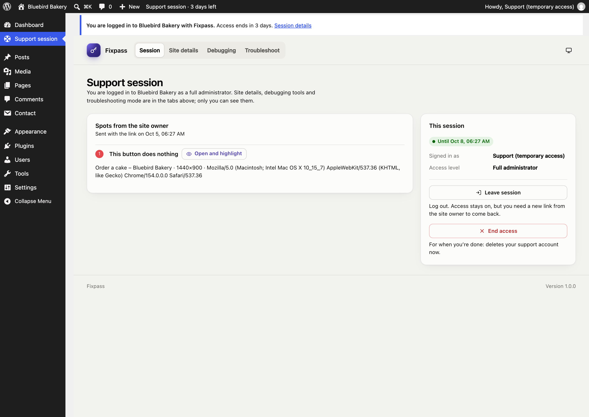
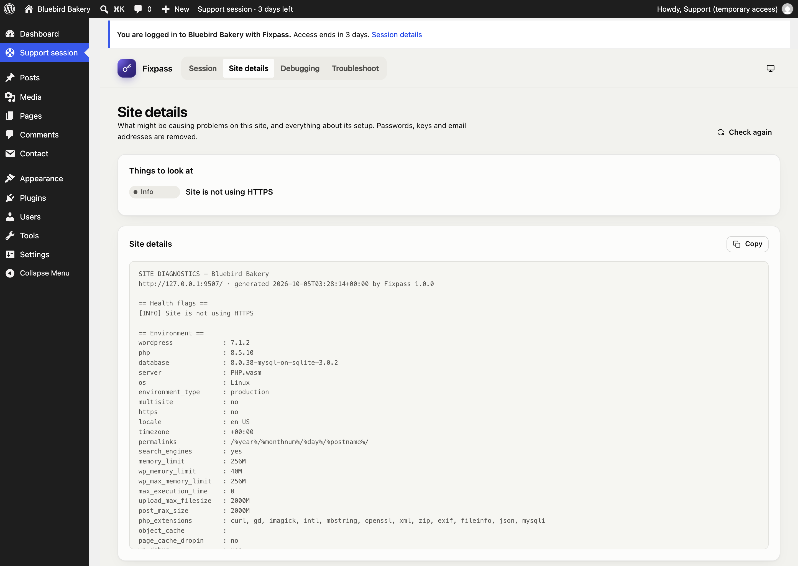
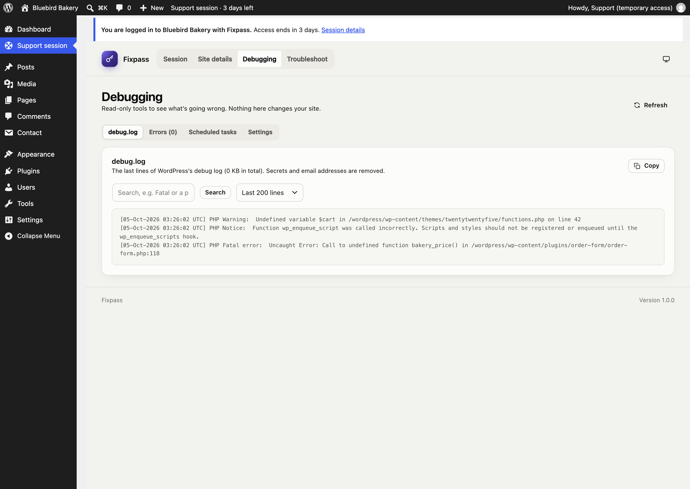

# For support teams

When a site owner gives you access with Fixpass, they send you **access details**: a login link, when access ends, any spots they marked, and their site's health, plugins and themes.

## Log in

1. Open the **Log in to the site** link.
2. A confirmation page shows how long access lasts. Click **Log in as support**. (The extra click stops email security scanners from using the link up.)
3. You land on the **Support session** page.

A **reusable link** works until access ends. A **one-time link** works once; ask the site owner for a new one to log in again.

You're logged in as a temporary administrator. A notice on every screen, and the **Support session** item in the toolbar, show how long access lasts.

## The Support session page

Four tabs, visible only to you (the site's own administrators don't see them):

### Session

- **Spots from the site owner:** each spot with its note, page, screen size and browser, any JavaScript errors and failed requests, and **Open and highlight**, which opens the page with the spot drawn on it.
- **This session:** when access ends, and two ways to finish:
  - **Leave session** logs you out. Access stays open; with a reusable link you can come back.
  - **End access** ends access for good when you're done: your account is deleted and you're logged out. The site owner sees "Support revoked access".

### Site details

What might be causing problems (health flags), and everything about the site's setup: WordPress, PHP and database versions, server, plugins, theme, recent errors and changes, and the end of the debug log. **Copy** puts it all on your clipboard. Passwords, keys and email addresses are removed.

### Debugging

Read-only tools:

- **debug.log:** the last 100 to 1000 lines, with search. If WordPress isn't writing a log, it says how to switch it on.
- **Errors:** PHP and JavaScript errors Fixpass caught.
- **Scheduled tasks:** WordPress's cron events, with late ones flagged.
- **Settings:** the WordPress constants that matter for debugging.

### Troubleshoot

[Troubleshooting mode](troubleshooting-mode.md): switch plugins off, or use a default theme, in your browser only.

## What you can't do

You're a full administrator, with two exceptions that protect the site owner:

- You can't create, edit, promote or delete users, so no account outlives your access.
- You can't deactivate or delete Fixpass.

Password login is switched off for your account; the link is the only way in.

## When access ends

When access ends (you end it, the owner ends it, it runs out, or the account is deleted), your account is deleted and any troubleshooting mode stops. Content you created is kept and given to the site owner.
