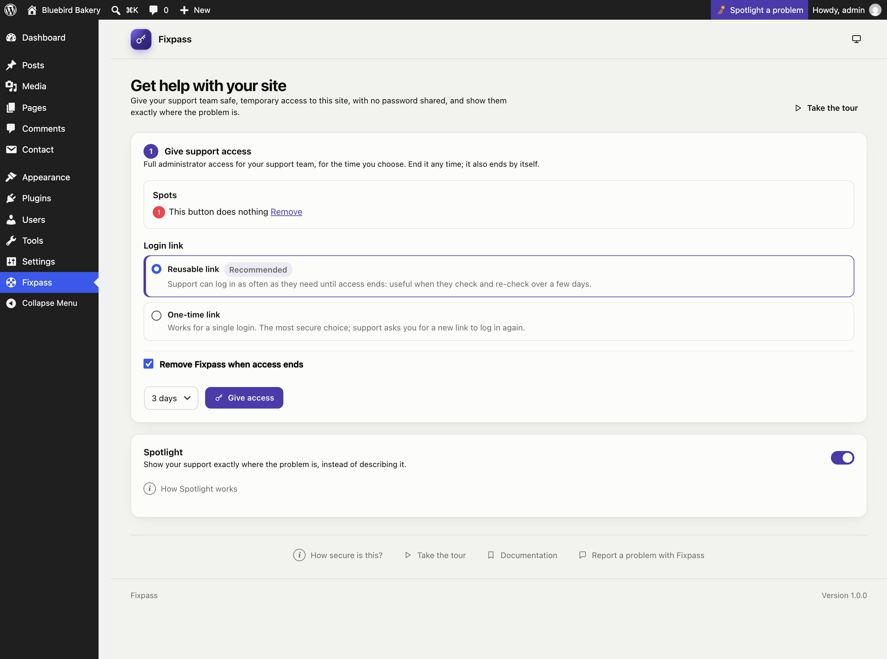
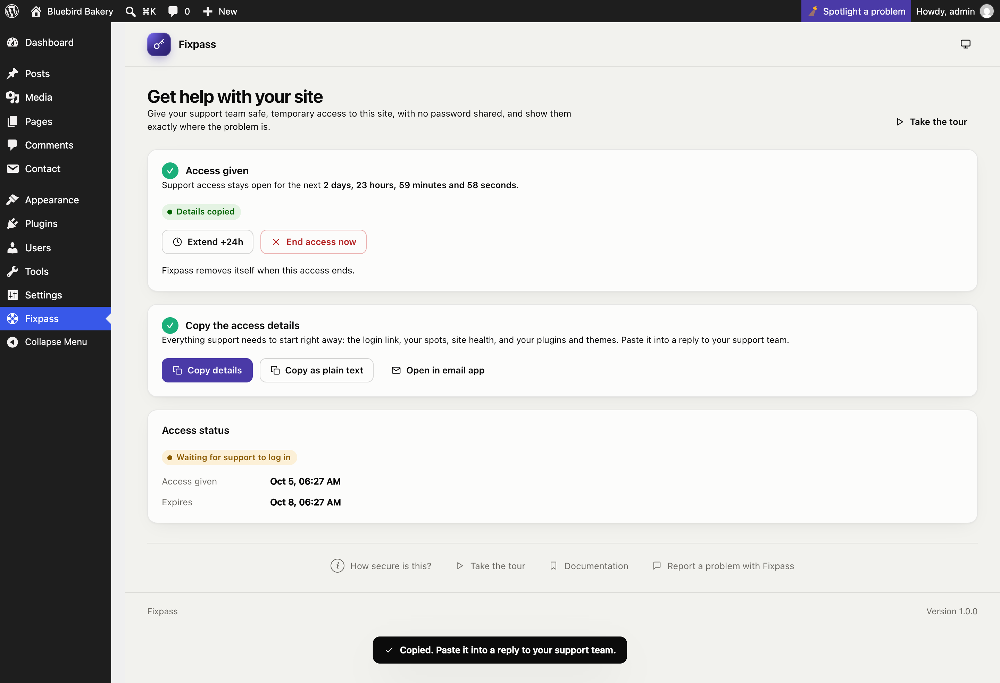
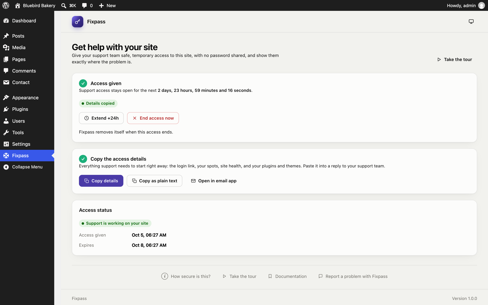
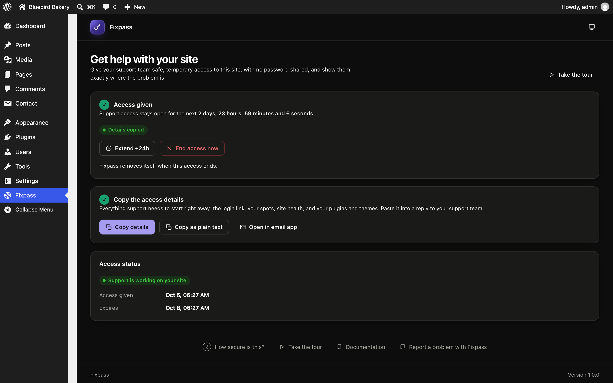
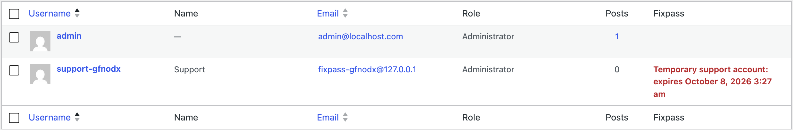

# Giving support access

Support access is a temporary **full administrator** account for your support team. There's no password: they log in with a link you send them.

## Step 1: Give access

On the **Fixpass** page:

- **Spots:** any spots you picked with [Spotlight](spotlight.md) are listed here and go with the access. Remove any you don't want to send.
- **Login link:**
  - **Reusable link** (recommended): support can log in as often as they need until access ends. Best when they check, change and re-check over a few days.
  - **One-time link:** works for a single login. The most secure choice; if support needs to log in again, they ask you for a new link.
- **Remove Fixpass when access ends** (ticked by default): once access has ended, for whatever reason, Fixpass deactivates and deletes itself about a minute later. Untick it if you want to keep Fixpass installed.
- **Length:** 1, 2, 3 (the default) or 5 days, or a week.

Click **Give access**. One support access can be open at a time.

## Step 2: Copy the details

- **Copy details** copies a formatted message (for email): a **Log in to the site** button, the link, when access ends, your spots with links that open each page highlighted, site health, recent fatal errors from the debug log, and your active and inactive plugins and themes.
- **Copy as plain text** copies the same as plain text, for tickets and chats.
- **Open in email app** starts an email with the details. Email apps cut long messages short, so for long details paste from **Copy details** instead.

Paste the details into a reply to your support team. This always reaches them, because it doesn't depend on your site sending email.

If your browser blocks copying, the text appears in a box so you can copy it yourself.

**Copying again later:** a reusable link comes back the same. A one-time link is replaced each time you copy after reloading the page, and the earlier link stops working.

## The status

While access is open, the page shows:

| Status | Meaning |
|---|---|
| Waiting for support to log in | The link hasn't been used yet. |
| Support is working on your site | Support is logged in. |
| Support logged out | Support logged out; access is still open. |
| Support ended the session | Support clicked **Leave session**; access is still open. |

The page refreshes the status every 30 seconds, and counts down to when access ends.

After access ends, **Last support access** shows how it ended:

| Status | Meaning |
|---|---|
| You ended access | You clicked **End access now**. |
| Support revoked access | Support clicked **End access** when they were done. |
| Access expired | The time ran out. |
| Access ended: the support account was deleted | Someone deleted the support account (for example on the Users screen). |
| Access ended: Fixpass was deactivated | Fixpass was deactivated while access was open. |

## Extend or end access

- **Extend +24h** adds a day. One access can last at most 30 days from when it was given.
- **End access now** ends it straight away: the support account is deleted and the link stops working.

However access ends, the support account is deleted for good.

## The Users screen

The support account shows in **Users** with a **Fixpass** column: "Temporary support account: expires …" while access is open. Other administrators can see what it is. Deleting it there ends the access.

