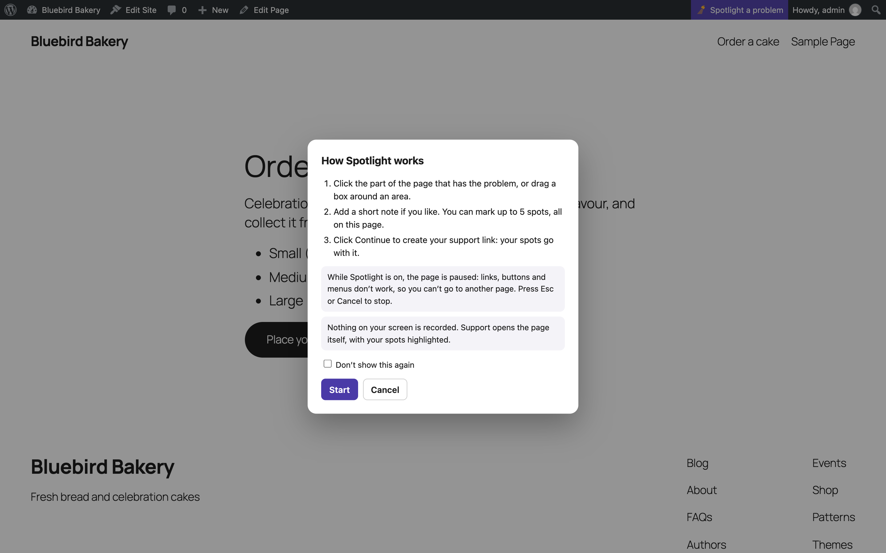
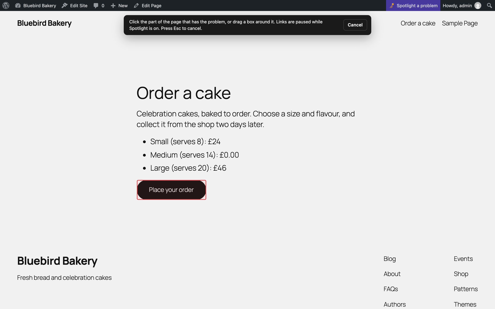
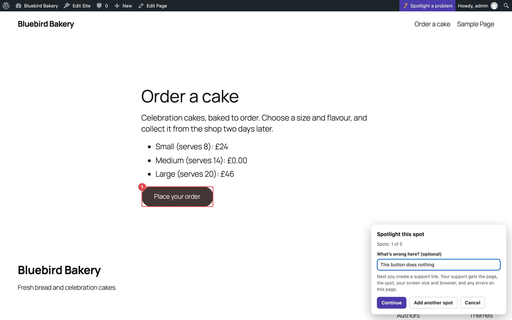
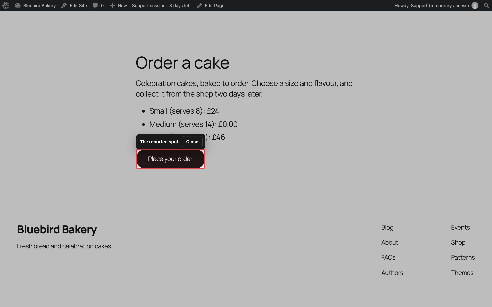

# Spotlight

Spotlight lets you point at a problem on the page itself, instead of describing it. Your support team opens the same page with your spot highlighted.

## Spotlight a problem

1. Go to the page with the problem: any page of your site, or of the dashboard.
2. Click **Spotlight a problem** in the toolbar at the top.
3. The first time, a short card explains how it works. Tick **Don't show this again** if you don't need it next time.
4. **Click** the part of the page that's wrong, or **drag a box** around an area.
5. Add a short note if you like ("wrong price", "button does nothing").
6. **Add another spot** for up to 5 spots, all on the same page, or click **Continue**.

**Continue** takes you to the Fixpass page with your spots listed under **Spots**, ready for [Give access](giving-access.md).

## While Spotlight is on

- **The page is paused:** links, buttons and menus don't work, so you can't go to another page. This is on purpose: your clicks pick spots.
- **Press Esc** or click **Cancel** to stop.
- All the spots in one go are on one page. For a problem on another page, finish first, then spotlight that page.

## What's sent with a spot

- The page address and title.
- Where the spot is on the page, so it can be highlighted again.
- Your note.
- Your screen size and browser.
- JavaScript errors on the page, and requests that failed.

Nothing on your screen is recorded or uploaded: no screenshots, no video. Support opens the real page.

## What support sees

Each spot has an **Open and highlight** link. It opens the page and draws a box where you pointed. If the page has changed and the exact element is gone, the box shows where it was.

Spots for pages in the dashboard need support to be logged in first.

## Turn Spotlight off

On the Fixpass page, use the switch on the **Spotlight** card. Spotlight is on by default.

The toolbar button is hidden while support access is open: the status is all you need then.
